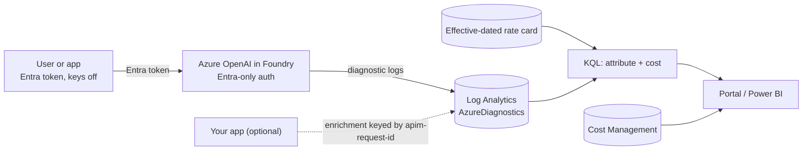
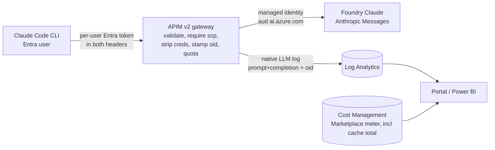

# Azure AI Spend Attribution Toolkit

Two working patterns for answering a simple question that turns out to be hard: which
person or app used how many AI tokens, and roughly what did it cost? Both patterns use
native Azure telemetry as the meter, price it with a rate card you control, reconcile the
estimate to Cost Management, and feed one consolidated portal.

This is an engineering toolkit, not a product. It ships scripts, queries, an APIM policy,
and a small HTML portal. You bring the Azure resources. Everything here is sanitized and
carries only placeholders like `<SUBSCRIPTION_ID>` and `<TENANT_ID>`.

## The two patterns

| | Pattern A: Azure OpenAI, no gateway | Pattern B: Claude via an APIM gateway |
|---|---|---|
| Attribution source | Native diagnostic logs (RequestResponse) | Native gateway LLM log joined to the stamped caller oid |
| Who you get | The authenticated data-plane caller (human on a user/OBO token, else the app/MI) | The signed-in human, even through a third-party CLI |
| Enforcement | None (showback only) | Per-user token quota (a guardrail, with overshoot) |
| Cost to stand up | Cheap, no new platform | An APIM v2 tier plus real hardening |
| Cache tokens | Captured per call (from AzureOpenAIRequestUsage) | Not captured per user on streaming; total-only reconcile |

Use Pattern A for showback on apps that authenticate with Entra. Move to Pattern B when you
need enforcement, or per-user attribution through a client you cannot instrument.

### Pattern A: attribution without a gateway



The platform log records the caller (`callerObjectId`) and the token counts. No API
Management, no change to the calling app for the core meter. One normalized row per call,
joined to the cached-token breakdown by correlation id.

### Pattern B: Claude Code through an APIM gateway



The gateway validates the user's own Entra token, so per-user prompt and completion tokens
are attributed and throttled even though Claude Code is a third-party CLI you do not control.

## Repository layout

```
AIBilling/
  README.md  LICENSE  .gitignore
  docs/                 how-it-works + one setup guide per pattern + portal
  aoai-no-gateway/      Pattern A: 9 files (diagnostics, KQL, rate card, enrichment, canary, DCR, Power BI)
  claude-gateway/       Pattern B: ARM, app registration, backend wiring, policy, diagnostics, client, sample agent, KQL
  portal/               index.html (3 views + combined), query-helper.ps1, config.sample.json
```

## Quickstart, Pattern A (Azure OpenAI, no gateway)

Services and the exact RBAC (including that querying needs Log Analytics Reader on the
workspace, not just Reader on the resource) are in `docs/02-setup-aoai-no-gateway.md`.

1. Run `aoai-no-gateway/01-enable-diagnostics.azcli` to turn keys off and send the
   `RequestResponse` and `AzureOpenAIRequestUsage` categories to Log Analytics.
2. Run `aoai-no-gateway/02-attribution.kql` in that workspace. Confirm one row per call.
3. Replace the illustrative rates with a real, effective-dated card (see
   `03-pricing-table.sample.csv`) and price the rows.
4. Optional: add app-side enrichment (`04-app-enrichment.py` / `09-app-enrichment.cs` with
   the table from `07-enrichment-table-dcr.bicep`) to get the user-and-app view.
5. Schedule the canary (`06-canary-schema-drift.kql`) so a schema change fails loudly.

Full walkthrough: `docs/02-setup-aoai-no-gateway.md`.

## Quickstart, Pattern B (Claude via gateway)

Services and the exact RBAC (the backend-role grant needs Owner or User Access Administrator
on the Foundry resource) are in `docs/03-setup-claude-gateway.md`.

1. Provision APIM v2: `az deployment group create -g <RESOURCE_GROUP> --template-file claude-gateway/01-apim-basicv2.arm.json --parameters serviceName=<APIM_NAME> publisherEmail=<ADMIN_EMAIL>`. Note the `principalId` output.
2. Create the gateway app registration (no admin consent): `claude-gateway/02-gateway-app-registration.ps1`.
3. Wire the backend and apply the policy: `claude-gateway/03-wire-backend.ps1`.
4. Enable gateway diagnostics: `claude-gateway/05-enable-diagnostics.ps1`.
5. Configure the client (`06-claude-code-settings.json` + `07-apikeyhelper.sh`) and prove
   the path end to end with `08-sample-agent.ps1`.
6. Report with `09-attribution.kql`.

Full walkthrough: `docs/03-setup-claude-gateway.md`.

## The portal

`portal/index.html` is a single self-contained page with three views: Azure OpenAI (no
gateway), Claude (via gateway), and a combined total. Each view adds a "token meters by model"
table (input / output / cache-write / cache-read / thinking) and a persistent honest-framing
banner. It is live-only. It reads `portal/data.json` and shows "Not configured" until you
generate it, and it ships with no sample data. Fill `config.sample.json` (save as
`config.json`), run `query-helper.ps1`, and reload. Details in `docs/04-portal.md`.

## The honest caveats

These come straight from the field runbooks. Read them before you put a number in front of
finance.

- Per-user needs the right token or a gateway. In Pattern A, per-human works only when the
  human is the data-plane caller (an interactive or on-behalf-of token). If apps call as a
  shared managed identity, everyone collapses to one principal, and per-user comes from the
  enrichment join or from Pattern B.
- Per-user cache is total-only on streaming. Pattern B captures prompt and completion tokens
  per user, not cache. Claude Code streams, and an outbound policy cannot reliably read a
  streamed body, so cache reconciles at the resource total. The full per-call meters — cache
  write (5m/1h tiers), cache read, and thinking — come from the app-side / non-streaming capture
  (`08-sample-agent.ps1`), not the streaming gateway path.
- Two meter algebras; thinking is never a separate charge. Azure OpenAI `prompt_tokens` includes
  the cached subset (billable input = prompt − cached; cache reads are discounted, and cache
  *writes* are billed only on GPT-5.6+ via `cache_write_tokens`). Claude `input_tokens` is already
  uncached, so total input = input + cache-write + cache-read (add, never subtract). Cache-write is
  a premium (5m ≈ 1.25×, 1h ≈ 2×) and cache-read a discount (~0.1×). Thinking / reasoning tokens
  are a subset of output — shown for transparency, never added to cost and never subtracted from
  it. See `docs/01-how-it-works.md`.
- Dollars are a list-price estimate. Both patterns price with a rate card and reconcile to
  Cost Management. Keep the variance as a named residual. Never smear it across individuals.
- Enforcement needs a gateway on a non-bypassable path. Pattern A does not enforce anything.
  Pattern B's quota is a guardrail that estimates for streaming and can overshoot, and it only
  holds if the gateway sits on a mandatory path (private network, MI-only backend, egress block).
- APIM v2 is required for the Anthropic llm-* policies. The `llm-token-limit` and native LLM
  logging understand the Anthropic Messages schema only on a v2 tier.
- Identity in the logs is worker-monitoring telemetry. `callerObjectId` and `x-caller-oid` are
  employee-identifying, and coding-tool usage is more sensitive still. Govern it: complete a
  privacy review or DPIA, restrict workspace RBAC, pseudonymize the id in reporting, set
  retention and residency, and apply small-cohort suppression.
- Some field names are pilot-observed, not contracted. In Pattern A, `callerObjectId` and the
  `CorrelationId == apim-request-id` join were observed in a pilot, not documented by Microsoft.
  Pin them and run the canary so a silent change surfaces as a coverage drop, not a wrong bill.

## License

MIT. See `LICENSE`.
