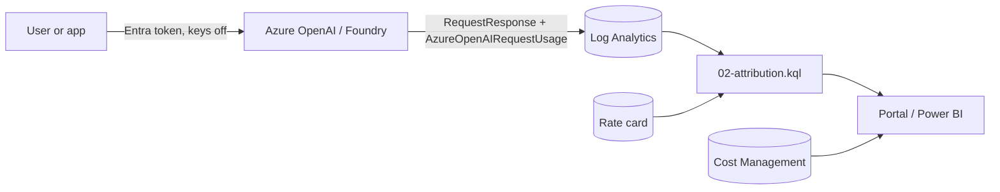
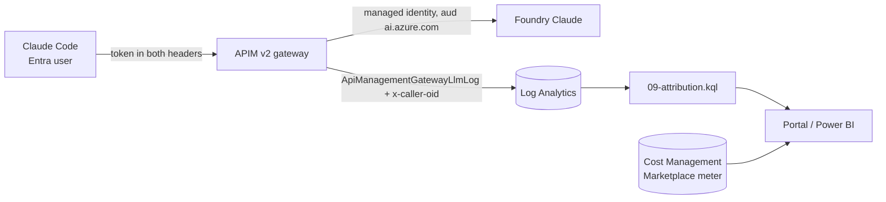

# How it works

Attributing AI spend to a person or a team sounds like a billing problem. It is really an
identity problem wearing a billing coat. The token counts are easy; Azure already records
them. The hard part is tying each call to a "who" you can defend, then turning tokens into
dollars you can reconcile. This toolkit does that two ways.

## The shared idea

Both patterns follow the same spine:

1. Use a native, non-spoofable meter. The platform records the authenticated caller and the
   token counts. You do not trust an app to self-report its own usage.
2. Join to a "who". In Pattern A the who is in the diagnostic log already. In Pattern B a
   gateway validates the user's token and stamps the id onto the log.
3. Price with a rate card you own, effective-dated, kept out of the repo.
4. Reconcile the estimate to Cost Management and keep the gap as a named residual.
5. Govern the identity data like the worker-monitoring telemetry it is.

## Pattern A: Azure OpenAI without a gateway

What the platform log actually contains, in the shared `AzureDiagnostics` table:

- `RequestResponse`, event `ShoeboxCallResult`, inside `properties_s`: `callerObjectId` (the
  Entra object id of the authenticated data-plane caller), plus `promptTokens` and
  `completionTokens` as scalars, plus the model and deployment names. Top-level
  `CorrelationId` equals the `apim-request-id` response header. There are two rows per call,
  one populated and one near-empty, so you filter `callerObjectId != ""` to avoid double
  counting.
- `AzureOpenAIRequestUsage`, event `ShoeboxAzureOpenAIRequestUsage`: `promptTokens[]`,
  `cachedTokens[]`, `generatedTokens[]` as single-element arrays. This is the only place with
  the cached breakdown, and it has no identity. You join it on `CorrelationId`.

Who you get depends on the token:

- A user or on-behalf-of token gives the human. Per-human works natively.
- A managed identity or service principal gives the app. Per-app is pending one verification
  in your own tenant (run `05-verify-sp-mi-caller.ps1`).
- It is never both at once. "Which user and which app" needs the app-side enrichment join,
  because the app is the only place that knows both.

The cost model has one trap worth stating plainly: cached input is a subset of input, priced
at a discount, not an extra line. Billable input is `promptTokens` minus `cachedTokens`.
Publish four separate measures, never one blended number: observed tokens, list-price
estimate, allocated cost (your tariff, if any), and billed cost from Cost Management.

Two field behaviors here are pilot-observed, not documented by Microsoft: `callerObjectId`
and the `CorrelationId == apim-request-id` join. Pin them and run the canary
(`06-canary-schema-drift.kql`) so a change shows up as a visible coverage drop, not a quietly
wrong bill.

## Pattern B: Claude Code through an APIM gateway

The gateway does five things in order: it validates the caller's Entra token, rejects
app-only tokens by requiring the delegated `scp` claim, strips the user credential so it never
reaches the backend, stamps the caller oid as `x-caller-oid` for the log to carry, and
enforces a per-user token quota. Then it calls Foundry Claude with APIM's own managed
identity, using audience `https://ai.azure.com`.

Attribution comes from APIM's native, streaming-safe LLM logging joined to the stamped oid,
not a custom body read. Claude Code streams over server-sent events, and an outbound policy
cannot reliably read a streamed body, so there is no per-call "full usage ledger" at the
gateway. Prompt and completion tokens are captured per user; cache tokens are not, and they
reconcile at the resource total against the Foundry metrics.

The auth flow is load-bearing and worth calling out. Claude Code has no interactive Entra
OAuth to a custom gateway, so a helper mints the per-user token and the CLI sends it in both
the `x-api-key` and `Authorization` headers. Three things must be proven in a pilot, not
assumed: the token audience is the gateway app (a token scoped to `ai.azure.com` is rejected),
the helper runs silently on a Conditional-Access-managed workstation, and the CLI version is
pinned because a future build could change the header behavior.

## When to use which

Use Pattern A for showback and reconciliation on apps that authenticate with Entra and,
ideally, carry the user's identity. It is cheap and adds no new platform.

Move to Pattern B when you need any of: hard per-user or per-team limits that fail closed,
per-user attribution when apps must call as a shared identity, a contracted meter rather than
a pilot-observed log field, or coverage of a client you cannot instrument. A gateway is not a
free fix: if it only ever receives a shared managed identity it still cannot reconstruct the
human, and it must sit on a mandatory path to enforce anything.

## Governance, in one place

Both patterns write employee-identifying telemetry. Treat it as worker monitoring: complete a
privacy review or DPIA before production, restrict Log Analytics RBAC, pseudonymize the id in
the reporting layer while keeping the mapping in a restricted dimension, set retention and
residency deliberately, and apply small-cohort suppression so a team of one is not singled
out. Do not log prompt or completion bodies, and deny-list the `Authorization` and `x-api-key`
headers on every logger so a token is never captured in diagnostics.
