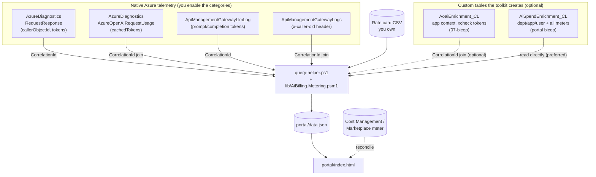
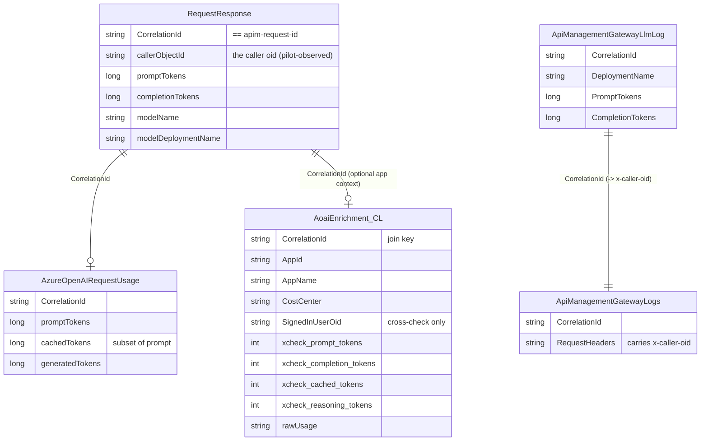
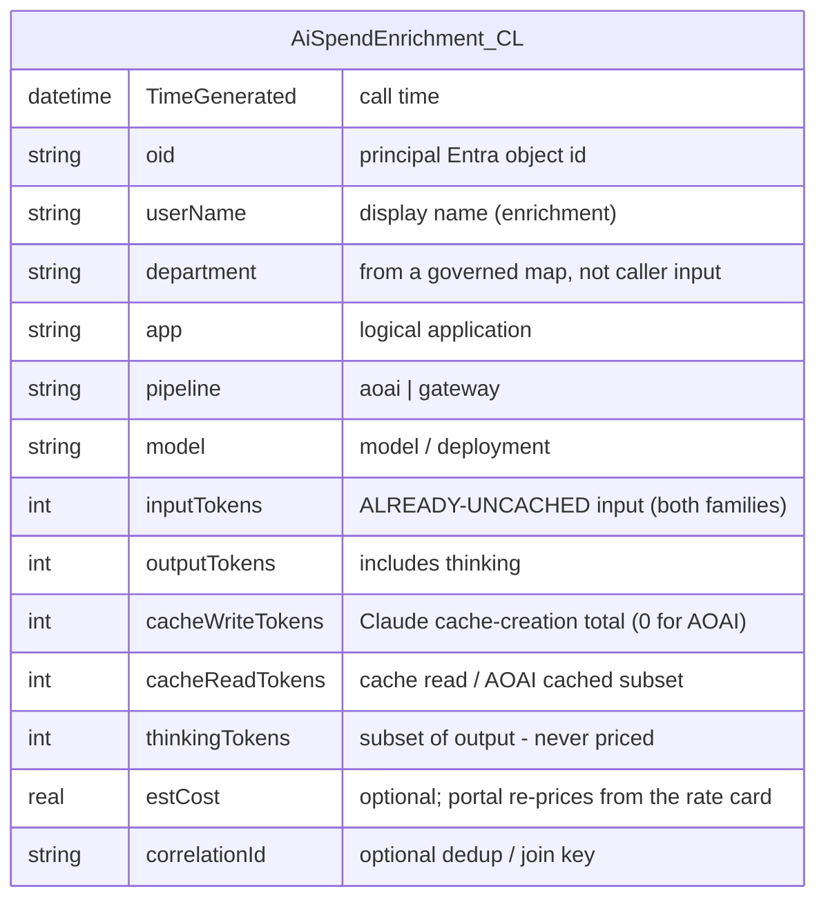

# Data model: the tables, where they come from, and how they join

This page shows every table and file the toolkit touches, which ones **already exist** in Azure
versus which the toolkit **creates**, their schemas, and the keys that join them. If you only read
one diagram, read the first.

## What is native vs what the toolkit creates

| Store | Kind | Native or created? | Used by |
|---|---|---|---|
| `AzureDiagnostics` — `RequestResponse` rows | Log Analytics (shared table) | **Native** (you enable the diagnostic category) | Pattern A attribution |
| `AzureDiagnostics` — `AzureOpenAIRequestUsage` rows | Log Analytics (shared table) | **Native** | Pattern A cached-token subset |
| `ApiManagementGatewayLlmLog` | Log Analytics | **Native** (you enable the APIM diagnostic) | Pattern B per-user tokens |
| `ApiManagementGatewayLogs` | Log Analytics | **Native** | Pattern B — carries the stamped `x-caller-oid` |
| `AoaiEnrichment_CL` | Log Analytics **custom table** | **Created** by `aoai-no-gateway/07-enrichment-table-dcr.bicep` | Pattern A app-context cross-check (join by `CorrelationId`) |
| `AiSpendEnrichment_CL` | Log Analytics **custom table** | **Created** by `portal/enrichment-table-dcr.bicep` | The portal's rich dept/app/user store (read directly) |
| Rate card CSV | File you own | **You provide** | Pricing, in `lib/AiBilling.Metering.psm1` |
| `portal/data.json` | File | **Generated** by `query-helper.ps1` | The portal reads it (git-ignored; holds live identity data) |

The toolkit **creates only the two `_CL` custom tables**, and both are **optional** — the native
logs alone give you attribution. You never modify the native `AzureDiagnostics` /
`ApiManagement*` tables; you only turn their diagnostic categories on.

## The whole picture



The query-helper prefers `AiSpendEnrichment_CL` when it exists (full dept/app/user drill). If it
is absent, it falls back to the native `RequestResponse` (+ `AzureOpenAIRequestUsage`) and
`ApiManagementGatewayLlmLog` (+ `ApiManagementGatewayLogs`) and attributes per principal.

## The join key everything hangs on

Every cross-table link in this toolkit is the same key: **`CorrelationId`**, which equals the
**`apim-request-id`** response header the caller sees. That is how a token count in one row finds
the identity or cache breakdown in another. (This equivalence is **pilot-observed, not contracted**
by Microsoft — see `docs/05-operations-and-gotchas.md`. The canary guards it.)



## The portal's spend store (the one that powers the drill-down)

`AiSpendEnrichment_CL` is a **standalone record per call** — the portal reads it directly, no join.
It is how you get department → app → user and the full cache/thinking meters for both patterns.
Create it with `portal/enrichment-table-dcr.bicep`; whatever emits records (your app, or an
ingestion adapter over the Claude sample-agent capture) writes this shape:



**Two enrichment tables, two jobs — do not confuse them:**

| | `AoaiEnrichment_CL` (07-bicep) | `AiSpendEnrichment_CL` (portal bicep) |
|---|---|---|
| Purpose | Add **app context** (AppId / cost center) to the native Pattern A log | A **complete spend record** the portal reads directly |
| How it's used | **JOINed** onto `RequestResponse` by `CorrelationId` | **Read standalone** (preferred portal source) |
| Token columns | `xcheck_*` — cross-check only; the native log is authoritative | The authoritative per-record meters for that record |
| Covers | Pattern A | Both patterns (aoai + gateway) |
| Required? | Optional | Optional (portal falls back to native logs) |

## The portal's `data.json` contract (generated, not a table)

`query-helper.ps1` flattens whichever source it used into one array the portal renders. It is
git-ignored because it holds live identity data.

```
{
  generatedAt, timeRangeHours,
  source: "enrichment" | "platform-log",   // which store produced the records
  queryOk: <bool>,                          // false => a query FAILED (portal shows a red banner, not $0)
  records: [ {
    ts, oid, user, department, app, pipeline, model,
    input, output, cacheWrite, cacheRead, thinking,   // integers or null (null = meter not on this path)
    cost, costBasis                                    // cost null = UNPRICED (never $0); basis full|p+c-only|unpriced
  } ]
}
```

## Pricing input (a file you own, not a table)

The rate card (`aoai-no-gateway/03-pricing-table.sample.csv`) is effective-dated and kept out of
any repo for real prices. `lib/AiBilling.Metering.psm1` is the single place that turns meters into
dollars, and `acceptance/run-acceptance.ps1` guards that math. Columns: `model`, `input_per_1m`,
`cached_input_per_1m` (AOAI), `output_per_1m`, `cache_write_5m_per_1m`, `cache_write_1h_per_1m`,
`cache_read_per_1m` (Claude), and `valid_from` / `valid_to` for effective dating.

## See also

- `docs/01-how-it-works.md` — the identity/token semantics behind these fields.
- `docs/02-setup-aoai-no-gateway.md` / `docs/03-setup-claude-gateway.md` — how the native logs get
  enabled and queried.
- `docs/04-portal.md` — how the portal consumes `data.json`.
- `docs/05-operations-and-gotchas.md` — the pilot-observed-field risk, retention, and teardown.
